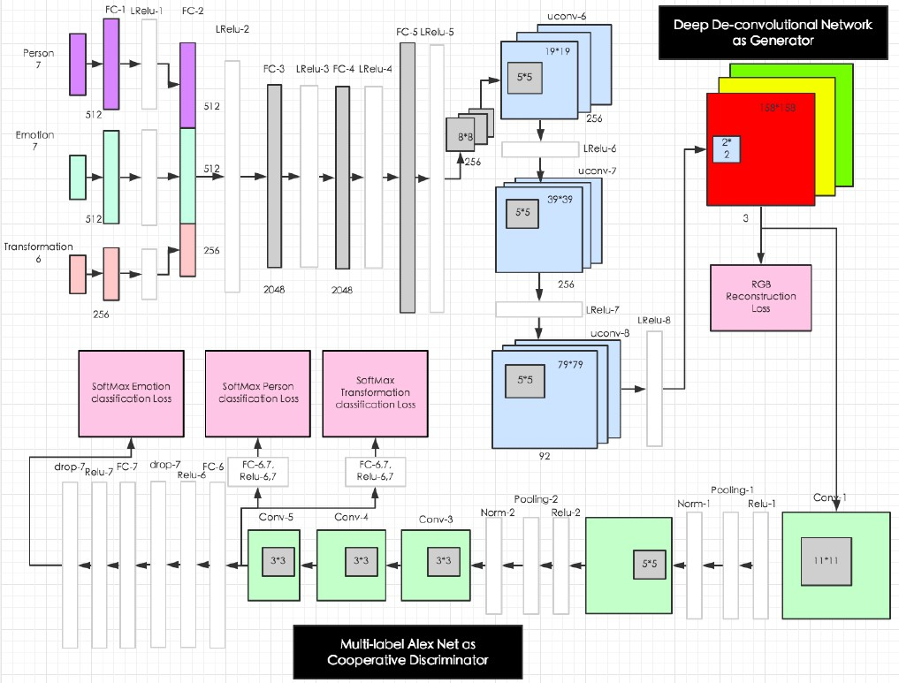
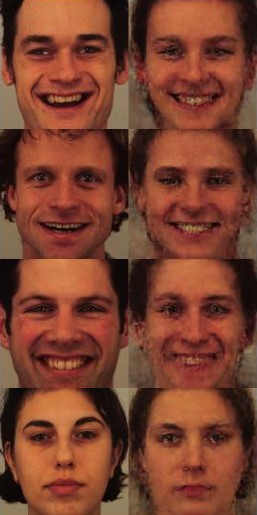
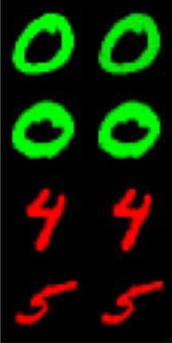
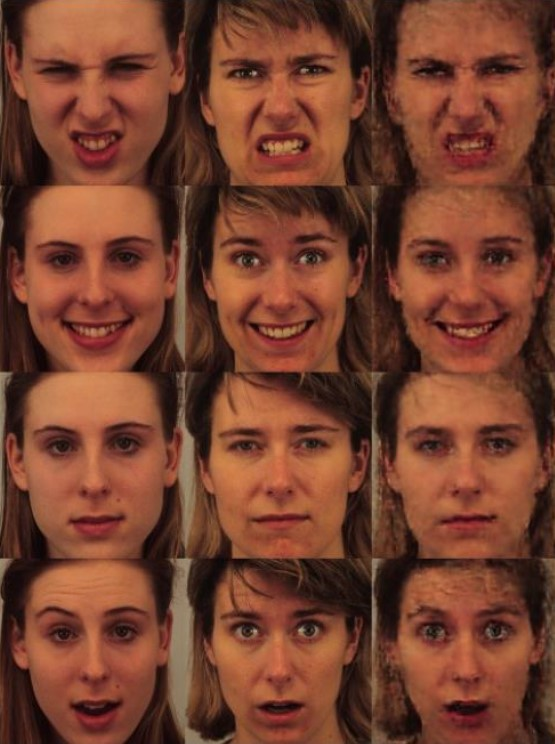

# Generative cooperative Net

An implementation of the paper entitled ["Generative Cooperative Net for Image Generation and Data Augmentation"](https://arxiv.org/abs/1705.02887) by Qiangeng Xu et al, as a part of the final project for the course Deep Learning at the spring semester of 2021, University of Tehran.

## DataSet
In this project we've use two different datasets:
- [Karolinska Directed Emotional Faces](https://www.kdef.se/)
- [QMNIST](https://github.com/facebookresearch/qmnist)

## Goals
This projects goal is to build a neural network to
- Generat images of faces (for KDEF dataset)
- Generat images of hadwritten number (for QMNIST dataset)
- Create a new augmentation tool: After training the GCN network and combining the identity features of two people with a ratio of 0.5, new images can be produced

## Training
With respect to different goals of hour network we train it on two different datasets as mentioned above. The input of networ for these datasets is different. 

### Input of Network for KDEF dataset
- a one-hot encoded vector for identity of the image (with length of 70) 
- a one-hot encoded vector for face expression of the image (with length of 4)
- a one-hot encoded vector for transformation of the number (with length of 8)
- an image with size of 28*28

### Input of Network for KDEF dataset
- a one-hot encoded vector for number of the image (with length of 10) 
- a one-hot encoded vector for color the number (with length of 3 for R, G and B)
- a one-hot encoded vector for transformation of the image (with length of 8)
- an image with size of 158*158

## Model
Our proposed model has two modules:
- Generator: generate image with an MSE loss 
- Classifier: classifies the generated image of generator.
In this structure, the generator and the classifier have goals in the same direction and they are trying to increase the quality of the produced images by working together. The Architecture of model is shown below  

## Results
Here we have the results for our metioned tasks
- Generating images of faces (for KDEF dataset)  

- Generating images of handwritten numbers (for QMNIST dataset)  

- Create a new augmentation tool  

## Team Members
- [Farhood Etaati](https://github.com/FeryET)
- [Amir Mesbah](https://github.com/amirhosein-mesbah)

